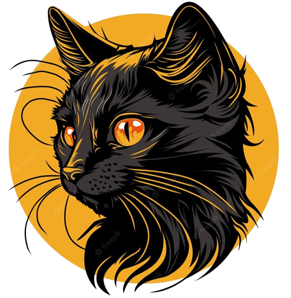

# Consulting Applicant Tracking System (CATS)
Unified platform for tracking Purdue Solutions applications. Coming in Fall 2023.
|                                                         PROD                                                         |                                                      DEV                                                       |
| ---------------------------------------------------------------------------------------------------------------------|----------------------------------------------------------------------------------------------------------------|
|        |  |
|                             |                          |

Author: [Adithya Chandrasekar](https://github.com/adithyachan)
© Purdue Solutions Consulting 2023

